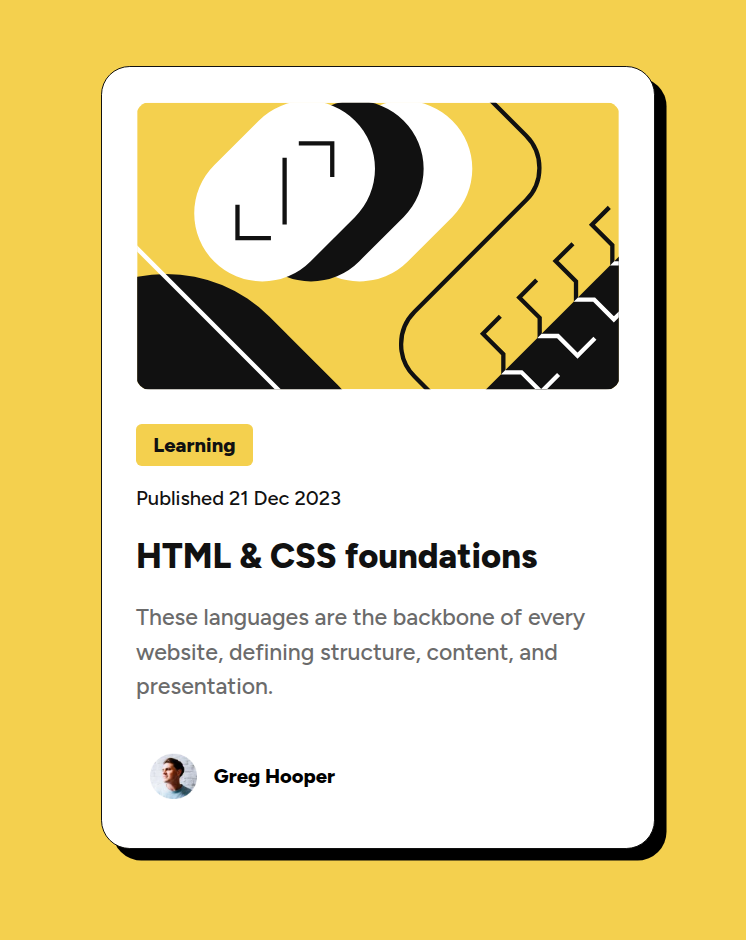

# Frontend Mentor - Blog preview card

This is a solution to the [QR code component challenge on Frontend Mentor](https://www.frontendmentor.io/challenges/blog-preview-card-ckPaj01IcS). Frontend Mentor challenges help you improve your coding skills by building realistic projects. 

## Table of contents

- [Overview](#overview)
  - [Screenshot](#screenshot)
  - [Links](#links)
- [My process](#my-process)
  - [Built with](#built-with)
  - [What I learned](#what-i-learned)
  - [Continued development](#continued-development)
- [Author](#author)


## Overview

### Screenshot



### Links

- Solution URL: [Blog preview card](https://your-solution-url.com)
- Live Site URL: [Live](https://your-live-site-url.com)

## My process

### Built with
- HTML - CSS
- Flexbox

### What I learned

By doing this challenge with the template on Figma, I learned how to define a complete font style in a variable.

```css
:root {
  --text-preset-1:  800 24px / 150% "Figtree", sans-serif;
}
```

### Continued development

I am resuming my study and practice of CSS. I had abandoned it and honestly didn't remember how much I enjoy doing this. My goal is to continue steadily on this path to find a job in this field.


## Author
- Frontend Mentor - [@oscar-ruinz](https://www.frontendmentor.io/profile/oscar-ruinz)
- Github - [@oscar-ruinz](https://github.com/oscar-ruinz)

