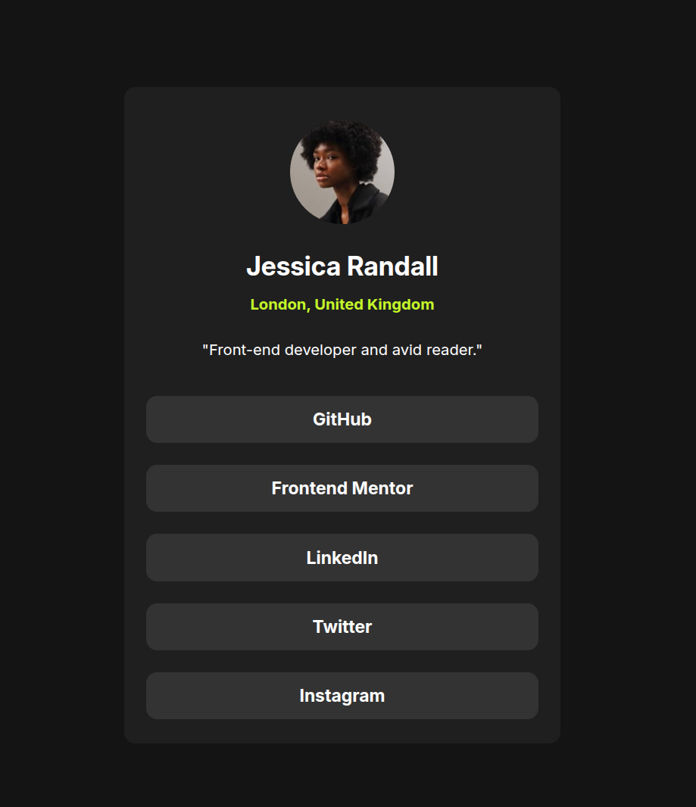

# Frontend Mentor - Social links profile solution

This is a solution to the [Social links profile](https://www.frontendmentor.io/challenges/social-links-profile-UG32l9m6dQ). Frontend Mentor challenges help you improve your coding skills by building realistic projects. 

## Table of contents

- [Overview](#overview)
  - [Screenshot](#screenshot)
  - [Links](#links)
- [My process](#my-process)
  - [Built with](#built-with)
  - [What I learned](#what-i-learned)
  - [Continued development](#continued-development)
- [Author](#author)

## Overview

### Screenshot

### Links

- Solution URL: [Social links profile]()
- Live Site URL: [Live]()

## My process

### Built with
- HTML - CSS
- Flexbox

### What I learned

I'm learn in this challenge to do the mobile first design, and is pretty fun.

### Continued development

I am resuming my study and practice of CSS. I had abandoned it and honestly didn't remember how much I enjoy doing this. My goal is to continue steadily on this path to find a job in this field.

## Author
- Frontend Mentor - [@oscar-ruinz](https://www.frontendmentor.io/profile/oscar-ruinz)
- Github - [@oscar-ruinz](https://github.com/oscar-ruinz)

